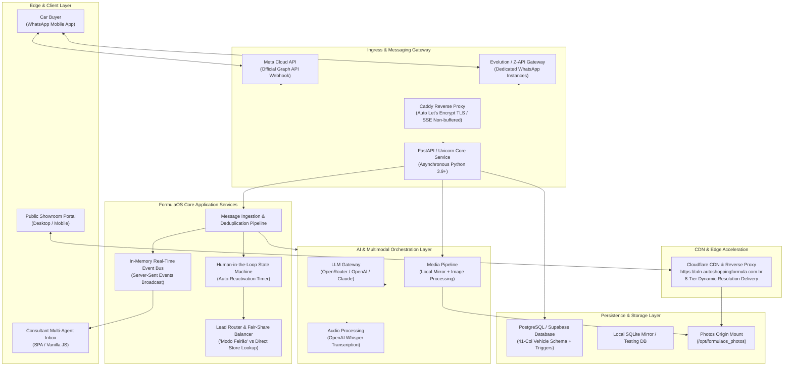
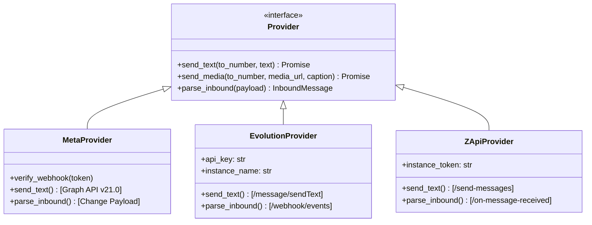
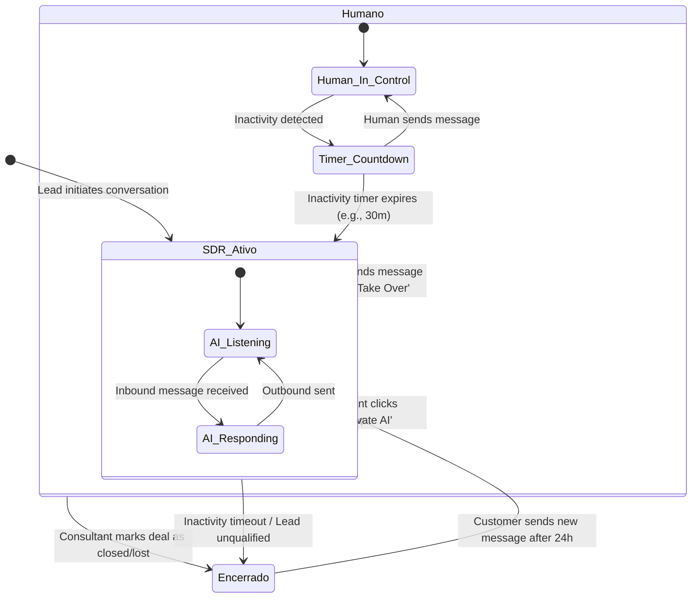

# FormulaOS: System Architecture & Technical Deep Dive
## Technical Presentation for Enterprise Architects & Engineering Leadership (English)

---

### Slide 1: Title & Engineering Overview
#### **FormulaOS: Architectural Deep Dive**
*A Resilient, High-Throughput, Multi-Tenant Operating System for Automotive Retail*

- **Focus:** System Topology, Event-Driven Ingestion, Hybrid Messaging Gateways, Contextual AI Orchestration, and Data Governance.
- **Presenter:** FormulaOS Engineering & Architecture Team
- **Target Audience:** CTOs, Lead Architects, VP of Engineering, Security & Compliance Officers.

> **Speaker Notes:**
> "Welcome. In this technical deep dive, we will unpack the architecture, data models, real-time messaging pipeline, and AI orchestration engines that power FormulaOS in mission-critical automotive retail environments."

---

### Slide 2: High-Level System Architecture & Topology
#### **End-to-End Distributed Architecture**



> **Speaker Notes:**
> "Notice the separation of concerns: The ingress gateway accepts webhooks from multiple WhatsApp providers, normalizes them into standard message objects, evaluates human intervention state, and routes to our AI orchestrator or the human sales feed via Server-Sent Events."

---

### Slide 3: Multi-Tenant Data Modeling & Segregation
#### **Hierarchical Entity Relationships & Role-Based Access Control (RBAC)**

FormulaOS uses a clean, relational schema designed for multi-dealership isolation:

```
┌─────────────────────────────────────────────────────────────┐
│                          TENANTS                            │
│  id, name, slug, domain, created_at                         │
└──────────────────────────────┬──────────────────────────────┘
                               │ 1 : N
┌──────────────────────────────▼──────────────────────────────┐
│                           STORES                            │
│  id, tenant_id, name, cnpj, whatsapp_number, active,        │
│  operation_mode ('normal' | 'feirao'), leads_this_month     │
└──────┬───────────────────────┬───────────────────────┬──────┘
       │ 1:N                   │ 1:N                   │ 1:N
┌──────▼─────────────┐  ┌──────▼─────────────┐  ┌──────▼─────────────┐
│      VEHICLES      │  │       USERS        │  │       LEADS        │
│ 41 Automotive Cols │  │ Store Managers,    │  │ Customer phone,    │
│ Live Stock State   │  │ Sales Consultants  │  │ trade-in, budget   │
└────────────────────┘  └────────────────────┘  └──────┬─────────────┘
                                                       │ 1:N
                                                ┌──────▼─────────────┐
                                                │   CONVERSATIONS    │
                                                │ status: SDR ativo, │
                                                │ Humano, Encerrado  │
                                                └──────┬─────────────┘
                                                       │ 1:N
                                                ┌──────▼─────────────┐
                                                │      MESSAGES      │
                                                │ Inbound / Outbound │
                                                └────────────────────┘
```

#### Enterprise RBAC Hierarchy:
1. **`master` (Platform Superadmin):** Cross-tenant governance, provisioning, and global telemetry.
2. **`gestor` (Mall / Group Manager):** Full visibility across all 20+ member dealerships, global lead distribution configuration, and mall-wide inventory.
3. **`lojista` (Store Owner / Manager):** Isolated to their own store's inventory, staff accounts, and assigned lead pipeline.
4. **`vendedor` (Sales Consultant):** Operational role managing assigned conversations, customer notes, and deal stages.

> **Speaker Notes:**
> "All database queries enforce tenant and store boundaries at the dependency injection level (`deps.py`). Server-side validation guarantees that a dealership consultant can never inspect or leak leads belonging to another showroom."

---

### Slide 4: Real-Time Ingestion & Event Bus Architecture
#### **Sub-Second Latency with Zero Client Polling**

- **In-Memory Event Bus (`backend/events.py`):**
  - High-concurrency event publishing built on Python asyncio Queues.
  - Channels segregated by tenant and user sessions.
- **Server-Sent Events (SSE) via `/api/events`:**
  - Lightweight, unidirectional HTTP streaming to mobile and desktop browsers.
  - Automatically pushes `new_message`, `conversation_updated`, `lead_stage_changed`, and `sdr_status` events.
  - Avoids the complex handshake and stateful proxy overhead of WebSockets while ensuring 100% firewall and mobile browser compatibility.
- **Caddy Proxy Configuration:**
  - Configured with `flush_interval -1` to disable reverse proxy output buffering, guaranteeing sub-50ms message delivery to client screens.

```python
# Event Bus Dispatch Pattern
async def publish(self, event_type: str, data: dict, store_id: Optional[int] = None):
    event = {"type": event_type, "data": data, "store_id": store_id, "timestamp": time.time()}
    for queue in self._subscribers:
        await queue.put(event)
```

> **Speaker Notes:**
> "By choosing Server-Sent Events over WebSockets, we achieve complete compatibility with mobile sleeping tabs, seamless auto-reconnect, and effortless horizontal scaling behind standard reverse proxies."

---

### Slide 5: The Hybrid WhatsApp Provider Gateway
#### **Adapter Pattern: Bridging Official Meta API & Custom Gateways**

To give automotive groups freedom of choice, FormulaOS implements an extensible **Provider Adapter Interface** (`backend/whatsapp/base.py`):



- **Per-Store Routing Registry (`backend/whatsapp/registry.py`):**
  - Each dealership can configure its own WhatsApp provider (`kind: "meta" | "evolution" | "zapi"`), API keys, and phone number ID.
  - Or, the mall can run a centralized hub number that auto-dispatches leads to dealer WhatsApps.
- **Deduplication & Webhook Security:**
  - Message signatures verified via `verify_token` or HMAC SHA256.
  - Inbound deduplication cache prevents re-processing duplicate webhook retries.

---

### Slide 6: The AI SDR Engine & Dynamic Context Injection
#### **Eliminating Hallucinations with Just-in-Time Catalog Ingestion**

Standard RAG (Retrieval-Augmented Generation) often suffers from stale vector embeddings when car prices change or vehicles are sold. FormulaOS uses a **Hybrid Context Engine**:

```
Inbound Lead Message ("Do you have an automatic SUV under $25,000?")
                      │
                      ▼
┌─────────────────────────────────────────────────────────────┐
│ 1. REAL-TIME SQL QUERY EXECUTION (Sub-15ms)                 │
│ SELECT id, brand, name, model_year, price, km, transmission │
│ FROM formulaos_vehicles                                     │
│ WHERE active = true AND sold = false AND store_id = :store   │
│ ORDER BY price ASC LIMIT 10                                 │
└─────────────────────┬───────────────────────────────────────┘
                      │ Live Formatted Compact Catalog
                      ▼
┌─────────────────────────────────────────────────────────────┐
│ 2. DYNAMIC SYSTEM PROMPT COMPILATION                        │
│ • Domain Persona: Consultative SDR for Auto Shopping        │
│ • Live Stock Injected: Exact prices, KM, transmissions      │
│ • Strict Commercial Boundary Rules                          │
│ • Max 1 emoji, concise colloquial PT-BR / EN phrasing       │
└─────────────────────┬───────────────────────────────────────┘
                      │ Single Low-Latency Inference
                      ▼
┌─────────────────────────────────────────────────────────────┐
│ 3. LLM INFERENCE GATEWAY (OpenRouter / GPT-5-mini / Claude) │
│ Generated Response: Accurate, truthful, conversion-oriented │
└─────────────────────────────────────────────────────────────┘
```

#### Key Technical Guardrails:
1. **Never Invent Inventory:** The LLM is strictly bounded to the vehicles injected in the system prompt. If no vehicle matches, it executes alternative recommendation logic.
2. **Post-Attendant Lock (`POS_ATENDIMENTO`):** Once a lead transfer is confirmed, subsequent polite messages from the customer ("Thanks", "See you tomorrow") are acknowledged without re-triggering duplicate CRM alert notifications.

---

### Slide 7: Multimodal Processing Pipeline
#### **Voice Notes & Vehicle Photos Architecture**

```
Inbound WhatsApp Payload (Audio / Image)
                 │
                 ├──► [AUDIO TYPE: voice / audio]
                 │         │
                 │         ▼
                 │    1. Stream raw audio bytes from WhatsApp Provider
                 │    2. Forward to OpenAI Whisper API (`model: whisper-1`)
                 │    3. Normalized transcription saved to `messages.body`
                 │    4. Audio player artifact saved for sales consultant UI
                 │    5. Transcription injected into conversation history
                 │
                 └──► [IMAGE TYPE: trade-in inspection / document]
                           │
                           ▼
                      1. Ingest image payload via media service
                      2. Generate MD5 checksum & write to local mirror
                      3. Upload to Cloudflare CDN asset bucket
                      4. Attach preview URL to lead drawer profile
```

- **Audio First-Class Citizen:** Brazilian and international car buyers frequently send voice notes instead of typing. FormulaOS transcribes voice in < 1.2s and responds in text or voice.

---

### Slide 8: Algorithmic Lead Distribution ("Modo Feirão")
#### **Deterministic Routing vs. Fair-Share Load Balancing**

FormulaOS includes a configurable lead distribution engine implemented in PostgreSQL / SQLite:

#### Algorithm A: Deterministic Listing Routing (Normal Mode)
Used when a lead arrives from a specific vehicle page:
$$\text{Target Store} = \text{Vehicle}.\text{store\_id}$$

#### Algorithm B: Fair-Share Load Balancer ("Modo Feirão")
Used during mega-sales events, marketing campaigns, or generic inquiries:

```sql
-- Weighted Fair-Share Distribution Algorithm
SELECT id, name, whatsapp_number
FROM formulaos_stores
WHERE is_active = 1
ORDER BY
    COALESCE(leads_this_month, 0) ASC,      -- 1. Prioritize stores with lowest leads
    COALESCE(updated_at, '1970-01-01') ASC, -- 2. Prioritize stores with least recent activity
    COALESCE(total_leads, 0) ASC,           -- 3. Historical tie-breaker
    RANDOM()                                -- 4. Entropy tie-breaker
LIMIT 1;
```

- **Atomicity:** When selected, `leads_this_month` and `total_leads` are incremented within the same transaction to prevent race conditions during high-volume spikes.

---

### Slide 9: Human-in-the-Loop State Machine
#### **Zero-Collision Handshake Between AI and Human Reps**



#### State Machine Safeguards:
- **Immediate Ingestion Check:** `handle_inbound()` in `ingest.py` performs a mandatory check: `IF conversation.status in ('Humano', 'Encerrado') THEN HALT_AI()`.
- **Auto-Reactivation Daemon:** A background task monitors `last_human_activity_at`. If a salesperson takes over but stops responding, the AI SDR gracefully reactivates to prevent customer abandonment.

---

### Slide 10: Media Pipeline & Cloudflare Multi-Resolution CDN
#### **High-Performance Automotive Asset Delivery**

Automotive portals require instant thumbnail rendering on mobile combined with high-resolution inspection zooms on desktop.

- **Base CDN Domain:** `https://cdn.autoshoppingformula.com.br`
- **Dynamic Partition Path:** `/storage/webdisco/{YYYY}/{MM}/{DD}/{RESOLUTION}/{HASH_MD5}.jpg`

#### 8-Tier Resolution Matrix:
```
┌──────────────┬────────────┬──────────────┬───────────────────────────────────────────┐
│ Resolution   │ Ratio      │ Dimension    │ Primary Platform Placement                │
├──────────────┼────────────┼──────────────┼───────────────────────────────────────────┤
│ original     │ Source     │ Variable     │ Lossless master backup                    │
│ 1200x900     │ 4:3        │ 1200 x 900   │ Primary catalog detail & full lightbox    │
│ 800x600      │ 4:3        │ 800 x 600    │ Tablet modal view                         │
│ 560x420      │ 4:3        │ 560 x 420    │ Desktop marketplace inventory card        │
│ 370x278      │ 4:3        │ 370 x 278    │ Mobile smartphone marketplace card        │
│ 270x203      │ 4:3        │ 270 x 203    │ Related vehicle sidebar recommendations   │
│ 120x120      │ 1:1        │ 120 x 120    │ Square avatar in WhatsApp multi-agent CRM │
│ 80x60        │ 4:3        │ 80 x 60      │ Gallery bottom thumbnail strip            │
└──────────────┴────────────┴──────────────┴───────────────────────────────────────────┘
```

- **Pillow & Libvips Async Processing:** Automatically crops, compresses (WebP/JPEG fallback), and uploads to object storage in background worker pools.

---

### Slide 11: Security, Data Privacy & GDPR / LGPD Engine
#### **Enterprise-Grade Governance Baked into Core APIs**

FormulaOS is built with strict privacy-by-design compliance:

- **Authentication & Session Management:**
  - Password hashing via **PBKDF2-SHA256** (custom salt, high iteration count).
  - Sessions tracked in database (`auth_sessions`) with revocation capabilities.
  - Authentication tokens transmitted exclusively via `httpOnly`, `Secure`, `SameSite=Lax` cookies.
- **Privacy Compliance Endpoints (GDPR & LGPD Art. 18):**
  - **Consent Opt-In / Opt-Out (`POST /api/conversations/:cid/consent`):** Tracks timestamped user consent for marketing and communication.
  - **Data Subject Access Request - DSAR (`GET /api/lgpd/subject?phone=...`):** Extracts all personal data, conversations, and interaction history tied to a phone number.
  - **Right to be Forgotten (`DELETE /api/lgpd/subject?phone=...`):** Anonymizes customer names, scrubs phone numbers, and redacts chat transcripts while preserving aggregated commercial transaction metrics.

---

### Slide 12: Consumption Telemetry & Billing Engine
#### **Granular Metering for SaaS Operators**

Every API call, token generated, and message dispatched is metered in `billing_events`:

```
┌─────────────────────────────────────────────────────────────┐
│                      BILLING TELEMETRY                      │
├─────────────────────────────────────────────────────────────┤
│ • Event Types:                                              │
│   - 'llm_tokens_in'  &  'llm_tokens_out'                    │
│   - 'whatsapp_message_in'  &  'whatsapp_message_out'        │
│   - 'whisper_audio_seconds'                                 │
│ • Aggregations:                                             │
│   - Total consumption by tenant                             │
│   - Consumption breakdown by store                          │
│   - Daily, weekly, and monthly cost curves                  │
└─────────────────────────────────────────────────────────────┘
```

- **SaaS Billing API:** `GET /api/billing/summary?since=...&until=...` provides instant breakdown for automated invoicing or tenant chargebacks.

---

### Slide 13: Deployment Topology & DevOps Specification
#### **Containerized, Cloud-Agnostic, Production-Ready**

```
┌─────────────────────────────────────────────────────────────┐
│                     DOCKER DEPLOYMENT                       │
│                                                             │
│   ┌─────────────────────┐         ┌─────────────────────┐   │
│   │   Caddy Container   │ ◄─────► │  FastAPI Container  │   │
│   │  Auto Let's Encrypt │         │    Python 3.9+      │   │
│   │   Reverse Proxy     │         │   Uvicorn Workers   │   │
│   └──────────┬──────────┘         └──────────┬──────────┘   │
│              │                               │              │
└──────────────┼───────────────────────────────┼──────────────┘
               ▼                               ▼
       HTTPS (Port 443)             Mounted Photos Volume
       Public Internet             (/opt/formulaos_photos)
```

- **Environment Standardization:** Packaged via Docker & Docker Compose.
- **CI/CD Quality Gates:** GitHub Actions workflow executing:
  - Automated testing with **Pytest** (36+ end-to-end and unit test suites).
  - Code hygiene and linting with **Ruff**.
  - Automated multi-arch Docker image builds.
- **Production Host Requirements:**
  - Standard Linux Host (Ubuntu 22.04 LTS / Debian 12) or Managed Cloud (AWS ECS / GCP Cloud Run / Railway).
  - 2 vCPU, 4GB RAM minimum for 50 concurrent showrooms.

---

### Slide 14: Engineering Roadmap & Future Capabilities
#### **The Next Horizon of Automotive AI**

1. **Vector Semantic Vehicle Search (pgvector):**
   - Natural language queries like *"Family car with large trunk, good on gas, under 60,000 miles"*.
2. **Automated Trade-In Damage Inspection (Computer Vision):**
   - Ingestion of 4-angle vehicle photos with automated visual damage detection and preliminary appraisal scoring.
3. **Bi-Directional DMS Sync:**
   - Plug-and-play connectors for CDK Global, Reynolds and Reynolds, AutoTrader, and regional ERPs.
4. **Autonomous Outbound Follow-Up Engine:**
   - Intelligent re-engagement for leads that went dormant after initial quote.

---

### Slide 15: Technical Summary & Architectural Advantages
#### **Why FormulaOS is the Standard for Modern Auto Retail**

- **Modular & Decoupled:** Clean adapter patterns for messaging, LLM gateways, and storage.
- **Reliable & Low Latency:** Asynchronous FastAPI core with Server-Sent Events guarantees immediate UI response.
- **Enterprise-Grade Privacy:** Native GDPR/LGPD compliance engine with complete auditability.
- **Domain-Specific:** Designed around automotive inventory, dealerships, and lead lifecycles.

> **Speaker Notes:**
> "Thank you for reviewing the technical architecture of FormulaOS. We are now ready to address specific engineering questions regarding API contracts, deployment configurations, or integration with your existing infrastructure."
